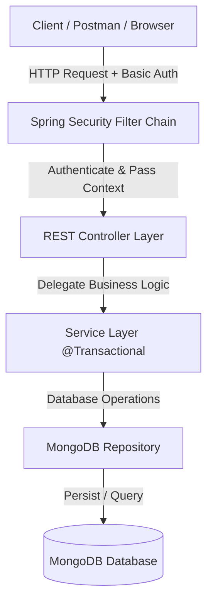

# 📖 Journal Prototype

<p align="center">
  
  
  
  
  
</p>

A production-grade RESTful web service built with **Spring Boot 4**, **Spring Security**, and **MongoDB** for personal journal entry management. The application features robust user authentication, Role-Based Access Control (RBAC), multi-document database transaction management, and personalized CRUD operations.

---

## 🛠️ Technical Stack

| Category | Technology | Description |
| :--- | :--- | :--- |
| ☕ **Language** | **Java 21** | Modern LTS Java runtime features |
| 🚀 **Framework** | **Spring Boot 4.0.7** | Core backend web framework & MVC controllers |
| 🗄️ **Database** | **MongoDB** | NoSQL document storage with Spring Data MongoDB |
| 🔒 **Security** | **Spring Security** | HTTP Basic Auth, Role-Based Access Control (RBAC) |
| 🔑 **Encryption** | **BCrypt** | Hashing algorithm for password security |
| 📦 **Build Tool** | **Maven** | Dependency management and project build pipeline |
| ⚡ **Utilities** | **Lombok** | Boilerplate code reduction (`@Data`, `@NoArgsConstructor`, etc.) |

---

## ✨ Core Features

- 🔒 **User Authentication & Security**:
  - Secure registration (`/signup`) with input validation and duplicate username check.
  - Password hashing using `BCryptPasswordEncoder`.
  - Endpoint protection and Role-Based Access Control (`USER`, `ADMIN`).
- 📝 **Journal Management**:
  - Full CRUD operations for journal entries linked to specific users.
  - Ownership isolation: Users can only view, update, or delete their own entries.
- 👑 **Admin Capabilities**:
  - System-wide inspection of all registered users and journal entries.
  - Admin user creation endpoint.
  - Automatic default admin user initialization (`Psyko`) on application startup.
- ⚡ **Data Integrity & Transactions**:
  - Multi-document MongoDB transaction management (`@Transactional`) ensuring data consistency when linking entries to users.

> [!NOTE]
> All user journal operations are tied directly to the authenticated session context via `SecurityContextHolder`, eliminating the need to pass user identity manually in URL path variables.

---

## 🏗️ Architecture & Data Flow



---

## 🗄️ Data Models

### 1. `User` (`users` collection)

| Field | Type | Description |
| :--- | :--- | :--- |
| `id` | `ObjectId` | Primary Key (MongoDB Object ID) |
| `userName` | `String` | Unique username (Indexed) |
| `password` | `String` | BCrypt-encoded password |
| `journalEntries` | `List<JournalEntry>` | Array of DBRef references to `JournalEntry` documents |
| `roles` | `List<String>` | Security roles (e.g., `USER`, `ADMIN`) |

### 2. `JournalEntry` (`journal_entries` collection)

| Field | Type | Description |
| :--- | :--- | :--- |
| `id` | `ObjectId` | Primary Key (MongoDB Object ID) |
| `title` | `String` | Title of the journal entry |
| `content` | `String` | Main text content |
| `date` | `LocalDateTime` | Timestamp of entry creation |

---

## 🌐 API Endpoints

### 1. Public Endpoints (No Authentication Required)

| Method | Endpoint | Description | Request Body | Response |
| :--- | :--- | :--- | :--- | :--- |
|  | `/health` | Application health check | None | `"All Systems Running!"` (`200 OK`) |
|  | `/signup` | Register a new user account | User JSON | Status message (`201 Created` / `400 Bad Request`) |

#### 📥 Example Request: Signup (`POST /signup`)
```json
{
  "userName": "Rishabh",
  "password": "RishabhGamerz123"
}
```

---

### 2. Authenticated User Endpoints (`USER` Role Required)

> [!TIP]
> Requires HTTP Basic Auth headers using your registered `userName` and `password`.

| Method | Endpoint | Description | Request / Path Parameters | Response |
| :--- | :--- | :--- | :--- | :--- |
|  | `/user` | Fetch authenticated user profile | None | `User` object (`200 OK`) |
|  | `/user` | Update username and password | User JSON | `204 No Content` / `404 Not Found` |
|  | `/user` | Delete authenticated user account | None | `204 No Content` |
|  | `/journal` | Fetch all journal entries of authenticated user | None | Array of `JournalEntry` (`200 OK` / `404 Not Found`) |
|  | `/journal` | Create a new journal entry for user | JournalEntry JSON | Created `JournalEntry` (`201 Created` / `400 Bad Request`) |
|  | `/journal/id/{myId}` | Get specific journal entry by ID | `myId` (ObjectId) | `JournalEntry` (`200 OK` / `404 Not Found`) |
|  | `/journal/id/{myId}` | Update specific journal entry by ID | `myId` (ObjectId), JournalEntry JSON | Updated `JournalEntry` (`200 OK` / `404 Not Found`) |
|  | `/journal/id/{myId}` | Delete specific journal entry by ID | `myId` (ObjectId) | `204 No Content` / `404 Not Found` |

#### 📥 Example Request: Create Journal Entry (`POST /journal`)
```json
{
  "title": "Book of Happiness",
  "content": "This is a journal entry about small reasons for happiness."
}
```

---

### 3. Admin Endpoints (`ADMIN` Role Required)

> [!IMPORTANT]
> Requires HTTP Basic Auth headers of an administrator account (e.g. `Psyko`).

| Method | Endpoint | Description | Request Body | Response |
| :--- | :--- | :--- | :--- | :--- |
|  | `/admin/users` | Retrieve all registered users | None | List of `User` (`200 OK` / `404 Not Found`) |
|  | `/admin/journals` | Retrieve all journal entries in database | None | List of `JournalEntry` (`200 OK` / `404 Not Found`) |
|  | `/admin/create-admin-user` | Create a new user with `ADMIN` privileges | User JSON | Created `User` (`201 Created` / `400 Bad Request`) |

---

## 📂 Project Structure

```
src/main/java/com/firstLearning/journalPrototype/
├── ⚙️ config/
│   ├── AdminUserInitializer.java   # Bootstraps initial admin user on startup
│   ├── SpringSecurity.java         # Security FilterChain, CORS, & BCrypt config
│   └── TransactionConfig.java      # MongoTransactionManager configuration
├── 🎮 controller/
│   ├── AdminController.java        # Admin operations (/admin)
│   ├── NewUserController.java      # Registration endpoint (/signup)
│   ├── UserController.java         # User profile management (/user)
│   ├── healthCheck.java            # System health check (/health)
│   └── journalEntityController.java# Journal CRUD operations (/journal)
├── 📦 entity/
│   ├── JournalEntry.java           # JournalEntry MongoDB document model
│   └── User.java                   # User MongoDB document model
├── 🗄️ repository/
│   ├── UserRepository.java         # MongoDB interface for User collection
│   └── journalEntryRepository.java # MongoDB interface for JournalEntry collection
└── 🧠 service/
    ├── NewUserService.java         # Handles user registration logic
    ├── UserDetailsServiceImpl.java  # Custom UserDetailsService for Spring Security
    ├── UserService.java            # User CRUD and BCrypt encoding logic
    └── journalEntryService.java    # Journal CRUD with transactional DBRef mapping
```

---

## 🚀 Getting Started

### 📋 Prerequisites

- **Java Development Kit (JDK)**: Version 21 or higher
- **Maven**: Version 3.8+
- **MongoDB**: Local instance or Cloud Cluster (MongoDB Atlas)

### ⚙️ Application Configuration

Configure your MongoDB database connection in `src/main/resources/application.properties`:

```properties
spring.mongodb.uri=mongodb+srv://<username>:<password>@<cluster-url>/<database-name>
spring.mongodb.auto-index-creation=true
```

### 💻 Running the Application

1. **Clone the repository**:
   ```bash
   git clone <repository-url>
   cd journalPrototype
   ```

2. **Build and run**:
   ```bash
   mvn clean spring-boot:run
   ```

3. The server will start on `http://localhost:8080`.

---

## 🔑 Initial Admin Credentials

> [!IMPORTANT]
> On application startup, `AdminUserInitializer` automatically creates a default administrator account if one does not exist:

- 👤 **Username**: `Psyko`
- 🔑 **Password**: `psyko7`
- 🛡️ **Roles**: `ADMIN`, `USER`